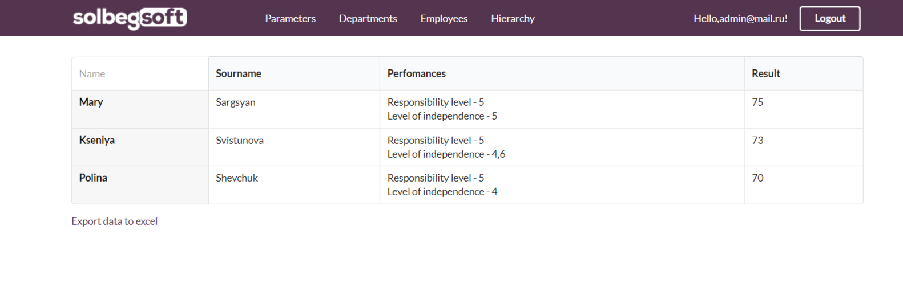

# Performans
<h3>This is an application for evaluating employees in the company</h3>

  After launching the application, you will be prompted to log in. You can log in to the system in 3 roles: administrator, department head and team leader. 
  You need to enter a login(Admin role - admin@mail.ru; Head role - Head@mail.ru; Tem leader role - TeamLead@mail.ru) and the password(123456).
  

<h3>Admin role</h3>
<ul>
  <li>
      

          As an administrator, all menu items in the site header are available to you. 
          After logging in, you will be taken to the parameters page, where the following functions will be available to you:
         <ol> 
           <li>Create new parameter</li>
            <li>Delete the parameter</li>
            <li>Edit the parameter</li>
            <li>viewing parameters list</li>
          </ol> 
      

          
 </li>
   <li>
      

          In the employees page, where the same functions will be available to you. 
          Remote workers will be marked with a red cross 
      

      
   </li>
   <li>
      

        The department page displays all departments in the form of cards, you can be on the department page by clicking on this card. 
        There is also the possibility of creating a new department
      

        
   </li>
   <li>
      

        On the department page, you can view all the information related to this department. 
        Here are the department employees, department parameters, and parameter groups. 
        Also here you can delete or edit the department.
      

      

        First of all, you can view the department employees part. 
        Name, sourname, recent estimates on the parameters of this department and the employee progress are presented here. 
        Also here are filters for viewing the positive and negative progress of employees.
      

        
      

        Second of all, you can view the department parameters part where the following functions will be available to you:
         <ol> 
           <li>Create new parameter</li>
            <li>Delete the parameter</li>
            <li>Edit the parameter</li>
            <li>viewing parameters list</li>
          </ol> 
      

        
        

        thirdly, you can view the department parameter groups part where the following functions will be available to you:
         <ol> 
           <li>Create new group</li>
            <li>Delete the group</li>
            <li>Edit the group</li>
            <li>viewing groups list</li>
              
            <li>
              Export groups list to Excel 
              You can download a file with groups by clicking on the button "Export to excel".
              
              
            </li>
            <li>
              

                 see the employees corresponding to the parameters of this group(Click on the "Show" button) 
                 After you click on the button next to the selected group, you will be prompted to enter the number of employees, 
                 after which a new page will open with department employees and their indicators in this group.
              

                  
                  
               

                  Also you can download a file with employees performance by clicking on the button "Export to excel"
               

                  
                  
            </li>
          </ol> 
      

   </li>
</ul>
<h3>TeamLead role</h3>
  

          As an team leader, the following menu items are not available to you: "Employees", "Departments", "Parameters" 
          After logging in, you will be taken to the evaluations page, where the following functions will be available to you:
         <ol> 
           <li>evaluating your subordinates</li>
            <li>Delete the evaluation</li>
            <li>Edit the evaluation</li>
            <li>views of the list of evaluations of your subordinates</li>
          </ol> 
      

          
 <h3>Head of department role</h3>
      

          Lika a team leader, the following menu items are not available to you: "Employees", "Departments", "Parameters" 
          After logging in, you will be taken to the evaluations page, whole department employees evaluations list will be available to you and you can do the same fuctionst.
      

          
 <h3>All roles</h3>
       

          All roles are available to viewing the "Hierarchy" menu item" 
          The hierarchy of the company is presented here.
      

          
